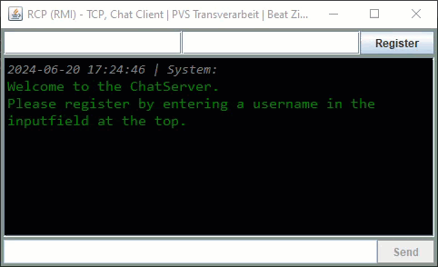
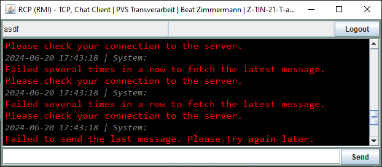

# pvs-transferarbeit
This is a graded exercise for 'Parallele und verteilte Systeme' on my path to 'Informatik HF'

To fully understand the task, please read the [Rahmenbedingungen](docs/Rahmenbedingungen.pdf) and 
[Aufgabenstellung](docs/Transferarbeit_Applikationsentwickler.pdf). But in short terms the task was to program a chat program with a central server. It should have a server and multiple clients that connect with that server. The clients can send messages to the server and the other clients can see the global history, so it can be used as a chat program.

  
## Prerequisite
- Installed java to run the application

## How To Run The `.jar` On Windows
Open `CMD` and type one of the following commands:
With the default `appsettings.yaml` file:   
`java -jar pvs-transferarbeit-server.jar`  
When not using the default `appsettings.yaml` file:   
`java -jar pvs-transferarbeit-server.jar --appsettings folder/appsettings.dev.yaml`

## How To Setup The Server
0. Configure the server settings in `appsettings.yaml` or go with the defaults
1. Run the `pvs-transferarbeit-server.jar`
2. Look for the message `Start server with port <port-number>` to appear, that the server has started correctly

## How To Setup The Client
1. Configure the server settings in `appsettings.yaml` or go with the defaults
2. Run the `pvs-transferarbeit-client.jar`
3. See the client window open and the greetings message from system
4. Register a user
5. Send chat messages

### Registry
Type in the username in the top-left input field and the password in the top-right input field and click `Register`. The server will respond to your action. Once registered you can log out by clicking the `Logout` button (former `Register`).
  

### Chat
Type in the message in the input field at the bottom and hit `ENTER` or press the `Send` button and your message will be sendt to the server.
  

## How To Configure Client And Server
Edit the `appsettings.yaml` file to make changes to the configuration of the server and/or client.

### General
The configrations in this section belongs to the client and the server.  
**rpc-name**: internal name for the rpc-server  
**ip-address**: ipv4 address the communication will happen  
**port**: the port number where the client and server communicate

### Server
The configrations in this section belongs to the server only.  
**max-message-history**: the maximum amout of messages the server stores internally before deleting messages from the store.

### Client
The configrations in this section belongs to the client only.  
**refresh-rate-ms**: the poll interval in milliseconds where the client gets new messages from the server  
**reset-rate-ms**: the time in milliseconds when the client loose all message history and get them newly from the server (may cause a loos of all system messages)
**get-message-max-fail-count**: the number of times the client ignores a failed message fetch from the server before displaying an error message to the user

## Troubleshoot
### Error On Client Start

If an error occurs during the start of the client application, then no connection to the server could be made. Please check that following:
- Server is running
- Server and client use the same configuration in the appsettings.general section
- Server and client refer to the same appsetting file

### Error On Login

If an error occurs on login, usually the password is misspelled, this is also the case, if someone else took your username first. The other reason can be that the server is not responding. This can have various reasons like the server is not connected or there is an internal server error and a restart is required.  

### Error On Message Fetch

If this error occurs then the `get-message-max-fail-count` has reached, which means the message fetch has faild several times. Most likely the server is down or the connection to the server is broken.

### Error On Message Send

The message you wanted to send has not made it to the server. Most likely the server is down or the connection to the server is broken.